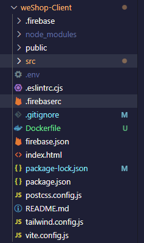
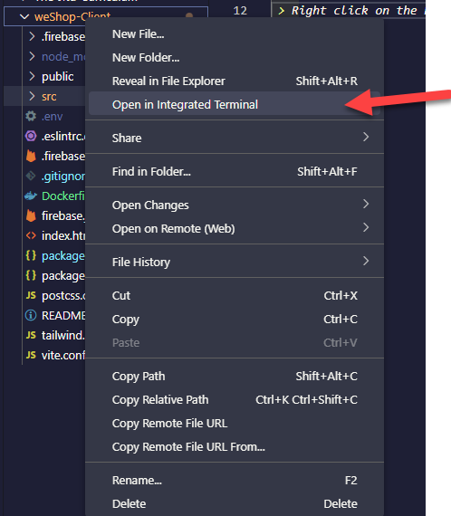
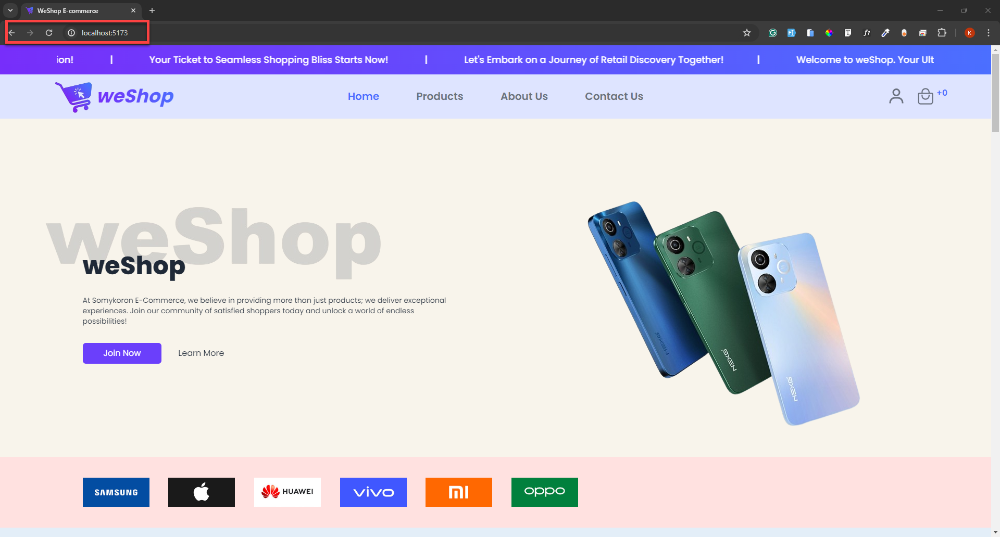

The Project was developed on windows Computer, the following the guides are for a windows computer

**1. Cloning the Project from Github**
> Open command  prompt and enter the command below.
``` git clone https://github.com/siraj3838/weShop-Client.git``` <br>
*Reason*: This command fetches all the files from the remote repository and sets up the necessary configuration to allow us to work with the repository locally.

 **2.Open the project in Vs code or the Editor of choice**
 > Create a 'Dockerfile" in the parent directory of the project.<br>
 <br>
 > Copy the contents of the docker file I have submited and paste in the docker file.
 > Right click on the Project folder and select open in Intergrated Terminal<br>
 <br>

 > <u>Configuring Fire base</u>
 1. Create a firebase account in  [Firebase](https://console.firebase.google.com/?_gl=1*159p64s*_up*MQ..*_ga*MzI4NTgzMjIxLjE3MTMzODE3NDM.*_ga_CW55HF8NVT*MTcxMzM4MTc0My4xLjAuMTcxMzM4MTc0My4wLjAuMA..)

 2. Login to your account.
 > Follow the following articel to create fire base project <br> [Creating a firebase project](https://docs.appmachine.com/app-details/firebase/create-firebase-project)
 > Follow the steps in the article below to register an application in the project created. <br>[Registering an App in Firebase Project](https://dev.to/irohitgaur/how-to-use-firebase-realtime-database-in-a-node-js-app-nn)
> Copy below object and paste in the pject in src/firebase/firebase.config.js and replace the existing code to create a connection to firebase.


**3. Working With Docker**
> a. Building the Docker Image - In Terminal Enter the following command
```docker build -t my-vite-app . ```
You should get an output in your terminal as the screenshot attached.<br>

<br>
> b. Run the Docker Container
 > The port used to access the application in localhost is ```5173```
 > Run the following command in Terminal after the fisrt one.
 ```docker run -p 5173:5173 my-vite-app```
You should get an output in your terminal as the screenshot attached


**4. Access the application after running the container**
> Open your browser, on a new tab paste the URL below and click 'Enter'
```http://localhost:5173```
You should get a page as shown below.
